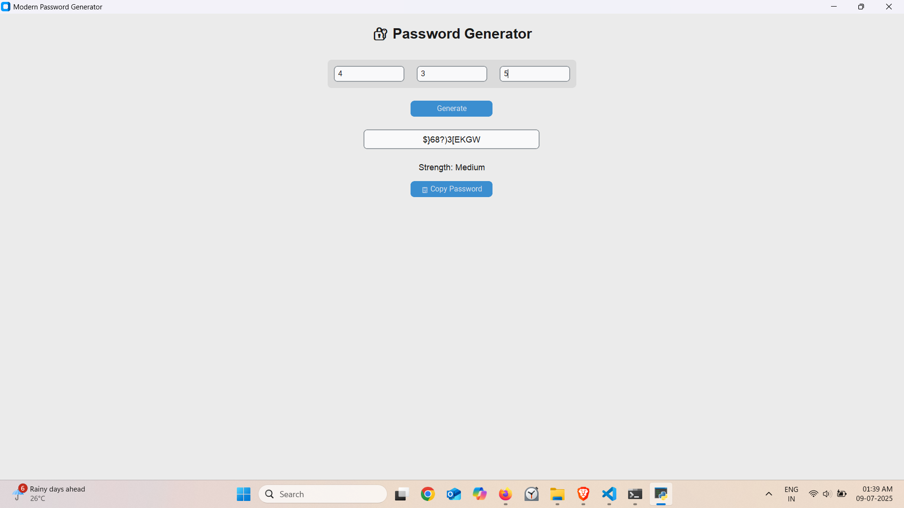

# 🔐 Password Generator - GUI Desktop App


A sleek and modern password generator built with **Python** and **CustomTkinter**, featuring a strength meter, clipboard copy, regenerate button, and save-to-file functionality.

---

## 🧠 Features

- ✅ Generate strong passwords with letters, numbers, and symbols
- ✅ Real-time password strength meter (Weak / Medium / Strong)
- ✅ Copy password to clipboard instantly
- ✅ Regenerate button for quick reset
- ✅ Save generated password to a `.txt` file
- ✅ Clean and modern GUI with `customtkinter`

---

## 🖼️ Screenshot



---

## 🚀 Getting Started

### 🔧 Requirements

- Python 3.10 or higher
- Install required libraries:

```bash
pip install -r requirements.txt
